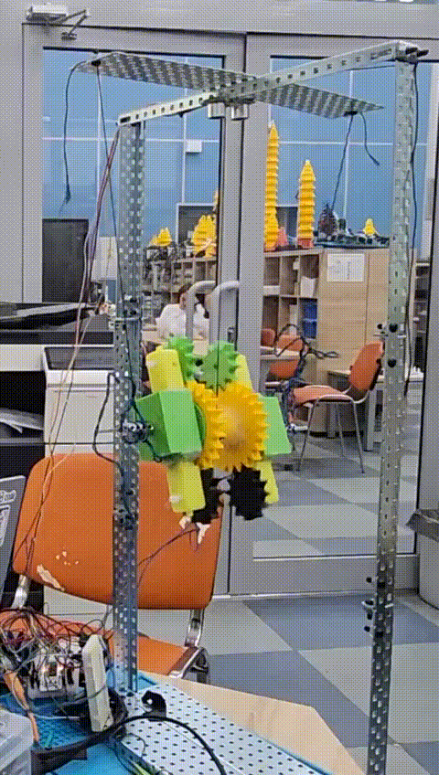

<h1 align="center">
<strong>FuzzyContApp 🪀</strong>
</h1>
<p align="center">
            

</p>
<p align="center">
    
    
    
    
</p>


<h3 align="center">
  Learn fuzzy logic with the example of the Maxwell's pendulum! 
      
[](https://github.com/Kristal1ik/FuzzyContApp/releases/tag/FuzzyLogic)

</h3>


## About
The need for `fuzzy logic` arises in many areas, including `artificial intelligence`, `control` and `decision-making`. Fuzziness is an integral part of the real world, so fuzzy logic is actively used to develop `intelligent systems` capable of processing and analyzing fuzzy information. The main problem of this topic is its **inaccessibility**. The fact is that the theory of fuzzy sets is studied at the senior courses of universities, and the materials presented in the public domain include terms, formulas and designations that are incomprehensible to **schoolchildren**. This project is aimed at **popularizing** fuzzy logic by writing an application for `Android OS`, as well as developing a real prototype of the `Maxwell pendulum` (the task is to keep the pendulum within the specified boundaries) to demonstrate the operation of a controller running on fuzzy rules.
Next, the functionality that allows the user to study the proposed topic will be described.
<p align="center">
    
</p>

## Documentation
> "Fuzzy logic is the art of finding beauty in uncertainty" — Lotfi A. Zadeh
>

<h2>
  Rule base
</h2>

To solve this problem, the theory of fuzzy sets is used, since it avoids a large number of calculations in fuzzy modeling problems.
The `rule base` consists of several fuzzy rules in which each gasified value of the pendulum **position** and **velocity** corresponds to a fuzzy number. The rule base may look like this:

$$RULE_1: \;IF\; «X_1» \;AND\; «V_1» \;THEN\; «Conclusion_1» \;(F1)$$

$$RULE_2: \;IF\; «X_2» \;AND\; «V_2» \;THEN\; «Conclusion_2» \;(F2)$$

<p align="center">
    
</p>
The figure shows the notation:

- x is the position of the pendulum;
  
- v is the speed of the pendulum;
  
- w – conclusion.

In the author 's code , the rule looks like this:
```python
x1 = Trapezoid([0.09,0.14,0.156,0.175,1]).trapezoid();
v1 = Trapezoid([0.280,0.351,0.466,0.616,1]).trapezoid();
w1 = Trapezoid([6.00,9.550,13.550,16.350,1]).trapezoid().
```
In the example above, there is a `Trapezoid` class that has a `trapezoid()` method that fuzzifies a number.

<h2>
  Accessory function(μ)
</h2>

`Fuzzification` is the process of translating input data into fuzzy data by finding the **degree** of belonging of a measurement to a fuzzy set. As input data, we get the `position` of the model (x) and the `velocity` (v). The trapezoidal membership function is given by four numbers and calculated according to the expression:

$$\mu=\begin{equation*}
 \begin{cases}
   1-\frac{b-x}{b-a}, a\le x\le b
   \\
   1, b\le x\le c
   \\
   1-\frac{x-c}{d-c}, c\le x\le d
   \\
   0, else
.
 \end{cases}
\end{equation*}$$

<h2>
  Optimization
</h2>

| Oprimization algorithm              | Description                                    |
|----------------------|---------------------------------------------------------------|
| `basin hopping` | A global optimization method used to solve optimization problems that have a complex energy surface. |
| `genetic algorithm`         |An optimization method that uses ideas from evolutionary biology and genetics to solve problems.                                                |
|`particle swarm algorithm` |An optimization method that simulates the behavior of a flock of particles in space to find optimal solutions in multidimensional problems.|


<h2>
  Behavior of the mathematical model
</h2>

This function gets the `position`, `speed` and `acceleration` from a given time, returns `new values` by certain transformations.

```python
  def f(x, v, w):
    a = (m * r * r * (g - w)) / (0.5 * (m * R * R + maxis * r * r) + (m + maxis) * r * r)
    if (x == R and v < 0) or (x == l and v > 0):
        v = -v * (1 - k)
    xnew = x + v * dt + 0.5 * dt ** 2 * a
    vnew = v + a * dt
    if xnew > l:
        xnew = l
    if xnew < R:
        xnew = R
    return xnew, vnew
```
The full version of the documentation you can find [here](https://disk.yandex.ru/d/bcef3xaBscWD3A).

## Functionality
-  Сontrol of the pendulum using the built-in accelerometer with the ability to change the parameters of the model.
-  Drawing up your rule base using the presented global optimization algorithms in the application (all has a description).
-  Control of the physical model of the Maxwell pendulum.
-  The imposition of rules on the mathematical model of the Maxwell pendulum.
- More information about the functionality and work of the physical model you can find [here](https://disk.yandex.ru/client/disk/FuzzyContApp?idApp=client&dialog=slider&idDialog=%2Fdisk%2FFuzzyContApp%2FDemo.MOV).


## Screenshots
<p align="center">
    
</p>

## Stack

- [Java (JDK 11)](https://docs.oracle.com/en/java/javase/11/)
- [Python 3.10.12](https://docs.python.org/3.10/index.html)
- [Android Studio Dolphin (2021.3.1)](https://developer.android.com/studio/releases/past-releases/as-dolphin-release-notes)
- [MPAndroidChart](https://github.com/PhilJay/MPAndroidChart)
- [SciPy (1.10.1)](https://docs.scipy.org/doc/scipy-1.10.1/index.html)
- [Matplotlib (3.6.3)](https://matplotlib.org/3.6.3/index.html)
- [MySQL](https://dev.mysql.com/doc/)

## Developer

- [Korobovtseva Olga](https://t.me/Kristall1k)

## License
Project FuzzyContApp is distributed under the MIT license.
